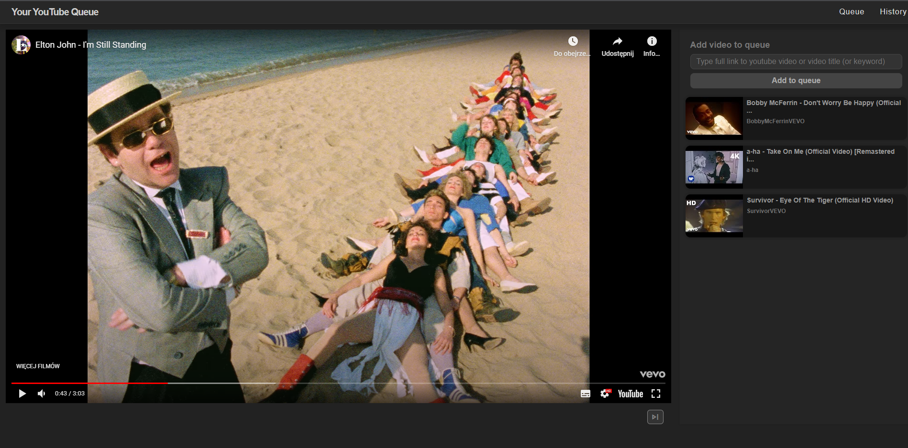

# YoutubeQueue

Single page application made with ReactJS.
Simple application to easy make "dynamic" youtube playlist without saving it or editing existing one.
User can add video to queue via search bar, which is searching videos by link (also from mobile app whose link is slightly different) or by video keywords (just like search works in youtube).
User can remove videos from queue, skip current video and add previous to the beginning of the queue.
Played videos are saved to history, where user can add them again to the end of the current queue.
Application is responsive.
Because it is pretty small application I decided to use core features of React instead implementing tools like redux for store, router to handling pages. UseState hook is handling page state, and context api to store current app state, such as queue or history.

## Demo

